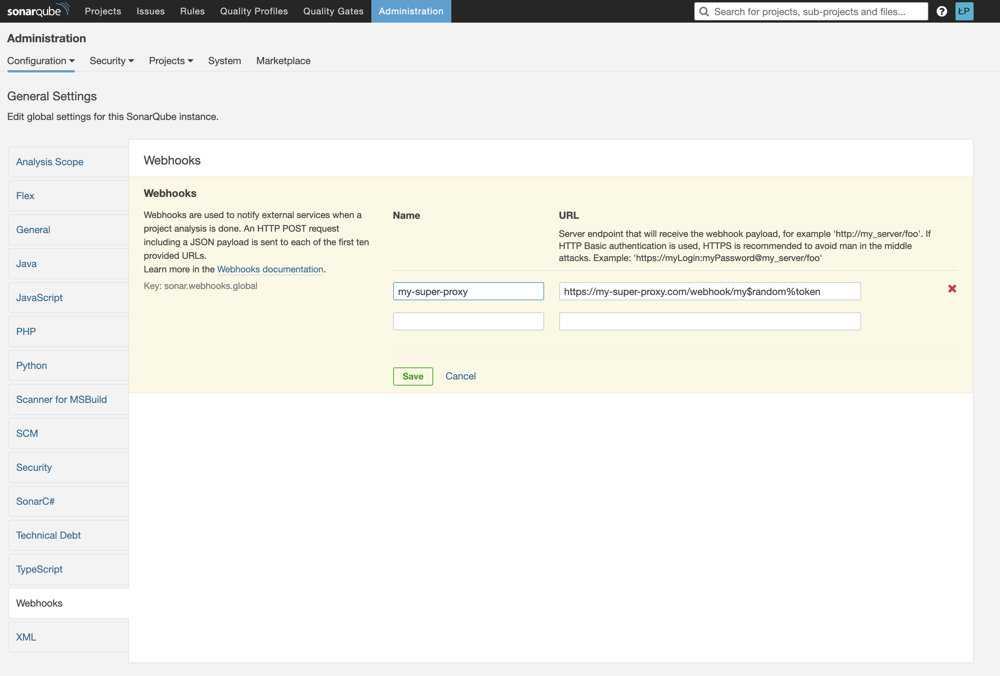

# Sonar-qube proxy app

### Environment variables
- **PORT** (default: 8080)
- **SONAR_QUBE_KEY** - Api key generated in sonarQube
- **SONAR_QUBE_URL**
- **WEBHOOK_TOKEN** - Token that should be added to webhook url (if you set `WEBHOOK_TOKEN=123` the webhook should be sent to the `webhook/123` url)
- **TOKEN** - Token to access the app. All endpoints (except webhook) require this token to be present in the `authentication` header

### Run development build
`npm run dev`

### Run production build
`npm run start`

### Configuring SonarQube webhook
**1. Set WEBHOOK_TOKEN env**
Set any random string as a WEBHOOK_TOKEN environment variable value, e.g. "my$random%token"

**2. Set webhook url in SonarQube**

- Go to Administration -> Configuration -> General Settings -> Webhooks
- Set a name of the webhook (it can be anything e.g. a name of the app that will receive the webhook requests)
- Set a webhook url (e.g. If proxy is available on `https://my-super-proxy.com` domain then the webhook URL is: `https://my-super-proxy.com/webhook/my$random%token`)
- Click "Save"
